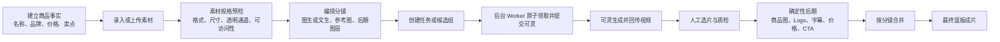

# 商品短视频工作台：产品说明

## 1. 产品定位

这是一个供内部运营团队使用的商品短视频生产工作台。它把真实的商品信息和商品素材作为唯一事实来源，结合可灵的视频生成能力、人工选片和模板化后期，批量产出竖版商品宣传短视频。

产品的核心原则是：**让模型负责运动、人物和场景；让真实素材与确定性模板负责商品、品牌、价格和文案。** 这样既利用 AI 提升创作效率，也降低商品形态漂移、Logo 错误、价格错误和字幕幻觉的风险。

适用场景包括新品素材制作、商品详情页短视频、站内活动素材、社媒种草短片和同一商品的多创意版本对比。

## 2. 用户与职责

虽然系统是内部工具、当前不设置登录鉴权，日常流程仍建议按职责协作：

| 角色 | 主要工作 | 关键产出 |
| --- | --- | --- |
| 商品运营 | 建商品事实、上传素材、配置价格与卖点 | 可用于制作的商品资料包 |
| 内容运营 | 编排分镜、设置场景和候选数量 | 待生成的视频创意方案 |
| 审片人员 | 对比候选、检查商品一致性、品牌和文案 | 每个分镜的入选片段及质检结论 |
| 发布人员 | 合成片段、确认最终成片 | 可发布的竖版短视频 |

## 3. 一条视频如何产出

### 3.1 建立商品事实

每个商品先录入名称、品牌、价格、规格、卖点和禁用词。后期模板默认从这里读取卖点和价格，避免运营人员在不同分镜里重复填写，或出现同一商品文案不一致。

### 3.2 管理商品素材

一个商品可使用以下素材：主图、角度图、细节图、场景图、透明底商品图、Logo 与场景设定图。

- 上传的图片先做预检：仅接受 JPEG、PNG、WebP；默认最大 20MB；普通商品图最短边至少 512px，Logo 至少 128px，长宽比不超过 4:1。
- 透明底商品图必须带 Alpha 透明通道，才能用于后期叠加。
- 通过上传接口上传的素材会进入七牛云 Kodo，并使用配置的 HTTPS CDN 地址给可灵拉取；本机的 `localhost` 只用于本地预览和本地成片访问。
- 已登记的外链素材也会在保存分镜、进入队列和合成前再次检查，尽早发现失效链接或被替换的文件。

### 3.3 编排分镜

一个分镜代表最终短片中的一个片段，单段时长限制为 1–5 秒。内容运营可以设置：

- 镜头类型：商品特写、主商品展示、使用场景、氛围或行动召唤；
- 生成方式：图生视频或文生视频；
- 商品主图与最多 8 张参考图，并指定其作用（商品身份、材质、细节、元素、Logo、场景设定）；
- 商品一致性约束；
- 后期图层：透明商品图、品牌 Logo、字幕、价格标签、CTA。

图生视频适合突出真实商品外观和细节；文生视频适合生成使用场景、人物、光线和氛围。无论采用哪种方式，品牌、价格和正式文案都不交给模型生成，而是在后期叠加。

### 3.4 生成、候选与后台调度

运营可为每个分镜创建单个任务，也可一次创建 2–4 个候选，以便比较镜头、动作和场景效果。

任务不会由页面直接长期等待。后台 Worker 会按全局并发配额自动处理：

1. 在 SQLite 事务内原子领取一条排队任务；
2. 使用固定的幂等键提交给可灵，避免重复点击或进程重启造成重复扣费；
3. 定时刷新生成状态；
4. 若进程在提交途中中断，租约超时后任务会被自动回收，并以退避方式重试。

可灵账号中已有的图生或文生视频也可以导入为某个分镜的候选片段，但仍需要走选片和质检流程。

### 3.5 选片、质检与追溯

候选片段生成完成后，审片人员选择每个分镜的最佳版本；如果一个分镜存在多个候选，系统会阻止直接合并最终视频，直到明确选中一个。

系统提供两种质检方式：

- 已接入视觉质检服务时：检查商品相似度、Logo 和 OCR 文案，并返回通过、复核或拒绝；
- 未接入时：明确标记为需要人工审核，不会虚构自动评分。

从商品创建、素材预检、任务领取与提交、候选选片、质检、后期合成到最终成片，系统都会记录追溯事件，方便定位素材、任务和成片的来历。

### 3.6 确定性后期与最终成片

选中的 AI 底片先经过 FFmpeg 后期：可叠加透明商品图、Logo、卖点字幕、价格和 CTA。系统随后强制校验片段规格，并按分镜顺序拼接。

成片规范固定为 **1080 × 1920、30fps、H.264、yuv420p**。同一组输入会命中内容寻址缓存，避免不必要的重复转码。

## 4. 核心业务对象

| 对象 | 业务含义 | 关系 |
| --- | --- | --- |
| 商品事实 | 商品名称、品牌、价格、卖点等标准信息 | 一个商品拥有多份素材和多个分镜项目 |
| 商品素材 | 主图、细节图、透明图、Logo 等真实文件 | 被分镜引用，并在生成/合成前预检 |
| 分镜项目 | 某条视频的创意编排 | 包含多个有顺序的分镜 |
| 分镜 | 一段 1–5 秒的视频方案 | 绑定主图、参考图、生成策略和后期图层 |
| 生成任务 | 一次提交给可灵的生成请求 | 一个分镜可有多个候选任务 |
| 候选片段 | 同一分镜的可比较版本 | 多候选时必须人工选中一个 |
| 质检记录 | 自动或人工的审核结果 | 关联到具体生成任务 |
| 最终成片 | 已合并的完整竖版视频 | 由每个分镜的后期片段组成 |

## 5. 当前能力边界

- 当前定位为内部工作台，不包含账号、权限、审批流或外部收费能力。
- 生成依赖可灵；商品图片输入依赖七牛云 CDN 的 HTTPS 可访问地址；后期合成依赖 FFmpeg 和 FFprobe。
- 视觉质检是可选集成。未配置时必须由人审核商品一致性、Logo 和字幕。
- 后期模板当前为竖版商品促销模板，主要支持透明商品图、Logo、字幕、价格和 CTA。
- `template_composite` 已作为分镜策略枚举预留，但当前可排队生成和最终拼接的主流程是图生视频与文生视频。

## 6. 日常操作建议

1. 先准备商品主图、透明底图和 Logo，再创建分镜；这样后期不会因缺素材失败。
2. 商品特写优先用图生视频；需要人物使用、空间和氛围时再采用文生视频。
3. 只对高价值或不确定的分镜创建 2–4 个候选，避免不必要的生成成本。
4. 选片后先完成质检，再做后期和最终拼接。
5. 修改价格、卖点或 Logo 后，建议重新执行相关片段的后期合成并复核最终成片。

## 7. 相关技术与部署文档

- [后端说明与接口调用顺序](README.md)
- [Windows 10 部署说明](DEPLOYMENT_WINDOWS10.md)
